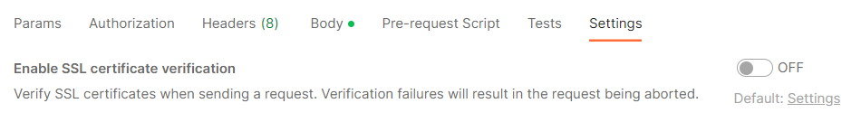

# Configuration tools

Use the following tools to make REST calls for the Client Failover Service:

## cURL

cURL is a command line tool makes HTTP calls and is supported on both Windows and Linux operating systems. You can script cURL with Bash or PowerShell on Linux or Windows and you can use it to perform adapter administrative and programming tasks. `cURL` commands are used in configuration and management examples throughout this document. For more information, see the [cURL documentation](https://curl.haxx.se/).

Throughout this document, there are command cURL examples that illustrate how to perform certain tasks, such as changing configurations or deleting a group. Within these examples are common command-line parameters that denote a specific action in cURL. This table contains a list of the parameters used in this document. 

| Parameter | Description         |
| --------- | ------------------- |
| -d        | HTTP Post data  |
| -H        | Pass custom headers to the server |
| -i        | Include protocol response headers in the output         |
| -k        | Bypass SSL certificate verification (do not include this if you have replaced the Client Failover Service default self-signed certificate with a CA-signed certificate)  |
| -u        | Server user and password |
| -X        | Specifies the HTTP method used when sending the request |

## Postman

Postman is a REST tool for systems with GUI components. AVEVA adapters are supported on platforms without GUIs. Postman is particularly useful for learning more about AVEVA Adapter REST APIs. For more information, see the [Postman documentation](https://www.postman.com/).

All endpoints in Client Failover Service require basic authentication in Postman to send a verified username and password with your request. Use the following steps to designate your authentication details in Postman: 

1. In Postman, click the ellipsis (...) next to your Collection name and select **Edit**. 
2. In the Edit Collection window, select the **Authorization** tab.
3. In the TYPE drop-down list, select **Basic Auth**.
4. Enter your system user name and password.

If you are running the Client Failover Service with the default self-signed SSL certificate, you must disable the "SSL Certificate Verification" option in Postman. To do this, open the request, select the **Settings** tab, and turn the verification setting to **OFF**.

If you have replaced the self-signed SSL certificate with your own CA-signed certificate (see [Certificate Management](xref:CertificateMgmtFailover)), it is recommended that you leave the verification set to **On** for security purposes.
