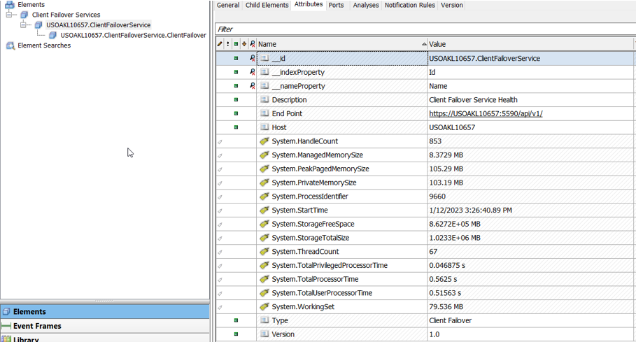
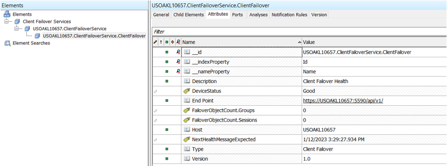

# Health and Diagnostics

Client Failover Service produces various types of health data. You can use health data to ensure that your Client Failover Service is running properly and that data flows to the configured OMF endpoint. For more information on available Client Failover Service health data, see [health](xref:AdapterHealth).

Client Failover Service also produces diagnostic data. You can use diagnostic data to find more information about a particular Client Failover Service instance. Diagnostic data lives alongside the health data.

PI Web API is the currently supported OMF endpoint for Client Failover Service health data. PI Web API parses the information and sends it to configured PI servers for the OMF endpoint. The static data is used to create an AF structure on a PI AF server. The dynamic health data is time-series data that is stored in PI points on a PI Data Archive. You can see it in the AF structure as PI point data reference attributes.

## AF structure

With a health endpoint configured to a PI server, you can use PI System Explorer to view the health and diagnostics of the Client Failover Service. The element hierarchy is shown here.

- The **Elements** root contains a link to the **Client Failover Services** node. This is the root node for all Client Failover Service instances.

    

- Select **Client Failover Services** to view all ClientFailoverService nodes. Each node's title is defined by the node's corresponding computer name and service name in the following format: {ComputerName}.ClientFailoverService. For example, in the following image, the computer name is “USOAKL10657”. .

- To view diagnostics values, select a ClientFailoverService node and then select **Attributes**.

    

