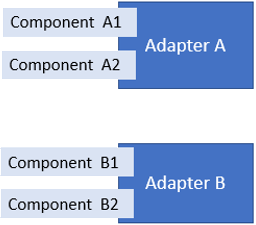

# Overview

The Adapter Failover Service is an application that minimizes data loss by configuring a set of two or more adapters into a failover group. The secondary adapter takes over whenever the primary instance has lost connection to the data source or the data endpoint. Adapters are responsible for monitoring one or more components, such as a relational database or an IP address.

This service features a configured health endpoints that receives the failover messages that help inform the adapter of its role in the failover group as well as provides users with the ability to monitor the adapter's health.

## Adapter installation

You can install the adapter with a download kit that you can obtain from the OSIsoft Customer Portal. You can install the adapter on devices running either Windows or Linux operating systems.

## Adapter configuration

Using REST API, you can configure all functions of the adapter. The configurations are stored in JSON files. For data ingress, you must define an adapter component in the system components configuration for each device to which the adapter will connect. You configure each adapter component with the connection information for the device and the data to collect. For data egress, you must specify destinations for the data, including security for the outgoing connection. Additional configurations are available to egress health and diagnostics data, add buffering configuration to protect against data loss, and record logging information for troubleshooting purposes.

After configuring the adapter and it is sending data, you can use administration functions to manage the adapter or individual ingress components of the adapter. Health and diagnostics functions monitor the status of connected devices, adapter system functions, the number of active data streams, the rate of data ingress, the rate of errors, and the rate of data egress.

You can configure the adapter for three levels of failover: hot, warm, and cold. Your failover level is dependent on the amount of data you can afford to lose and how much of a workload your system can handle.  

